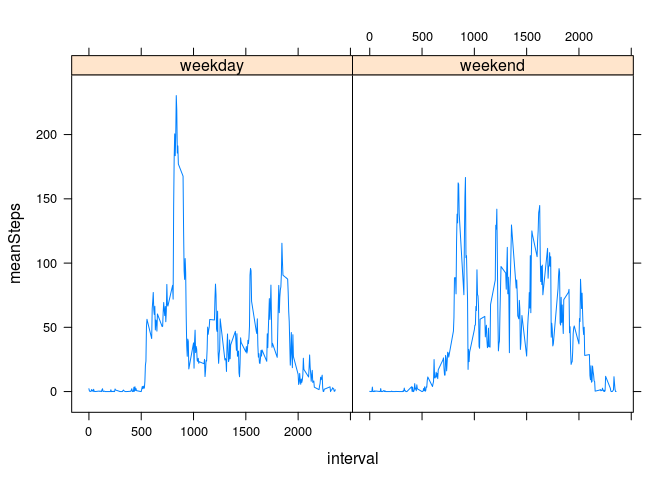

# Reproducible Research: Peer Assessment 1


## Loading and preprocessing the data

```r
setwd("/home/joe/knowledge/datascience/reproducibleresearch/RepData_PeerAssessment1")
if( !any(list.dirs(recursive=FALSE)=="./activity")){unzip("activity.zip")}
activitySet <- read.csv("activity.csv",header=TRUE)
```

## What is mean total number of steps taken per day?


```r
stepsPerDay = with(activitySet,tapply(steps,factor(date),sum))
hist(stepsPerDay)
```

 

```r
mean(stepsPerDay,na.rm=TRUE)
```

```
## [1] 10766.19
```

```r
median(stepsPerDay,na.rm=TRUE)
```

```
## [1] 10765
```


## What is the average daily activity pattern?


```r
meanSteps<- with(activitySet,aggregate(steps,by=list(interval),FUN=mean,na.rm=TRUE))
names(meanSteps) <-c("Interval","Steps")
with(meanSteps,plot(Interval,Steps,xlab="Minutes",ylab="Average step count",type="l"))
title("Average step count against time of interval")
```

 

```r
print(with(meanSteps,Interval[Steps==max(Steps)]))
```

```
## [1] 835
```


## Imputing missing values


```r
nas <-is.na(activitySet$steps)
length(nas[nas==TRUE])
```

```
## [1] 2304
```

```r
#fill nas with five minute interval average
activitySetComplete <- cbind(activitySet,rep(meanSteps$Steps,length(table(activitySet$date))))
names(activitySetComplete)[4] = "meanStepsByInterval"
activitySetComplete$steps[nas]<-activitySetComplete$meanStepsByInterval[nas]
#Regenerate histogram, mean and median with doctored dataset
stepsPerDayComplete = with(activitySetComplete,tapply(steps,factor(date),sum))
hist(stepsPerDayComplete)
```

 

```r
mean(stepsPerDayComplete)
```

```
## [1] 10766.19
```

```r
median(stepsPerDayComplete)
```

```
## [1] 10766.19
```


## Are there differences in activity patterns between weekdays and weekends?

```r
library(lubridate)
wend <- function(datestring){
  dn <-wday(datestring)
  if(dn==1 | dn==7) return("weekend")
  return("weekday")
}
activitySetComplete[,4]<-sapply(activitySetComplete$date,FUN=wend)
names(activitySetComplete)[4] <- "dayType"
```

```r
meanStepsWk<- with(activitySetComplete,aggregate(steps,by=list(interval,dayType),FUN=mean,na.rm=TRUE))
names(meanStepsWk)<-c("interval","dayType","meanSteps")
library(lattice)
xyplot(meanSteps~interval|dayType,meanStepsWk,type="l")
```

 

