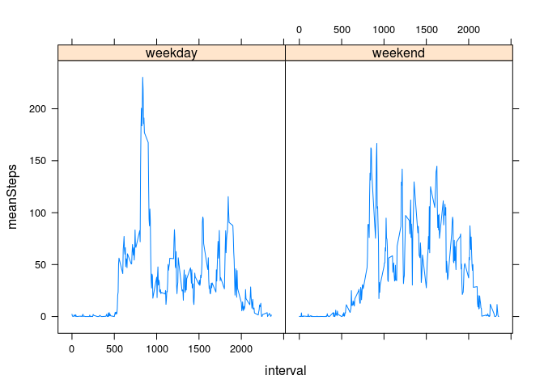

# Reproducible Research: Peer Assessment 1


## Loading and preprocessing the data  

```r
setwd("/home/joe/knowledge/datascience/reproducibleresearch/RepData_PeerAssessment1")
if( !any(list.files()=="activity.csv")){unzip("activity.zip")}
activitySet <- read.csv("activity.csv",header=TRUE)
```

## What is mean total number of steps taken per day?
Let's compute the total steps for each day, and create a histogram of total step counts.  
Then, compute the mean and median total steps:  

```r
stepsPerDay = with(activitySet,tapply(steps,factor(date),sum))
hist(stepsPerDay)
```

 

```r
mean(stepsPerDay,na.rm=TRUE)
```

```
## [1] 10766.19
```

```r
median(stepsPerDay,na.rm=TRUE)
```

```
## [1] 10765
```


## What is the average daily activity pattern?  
Let's observe the average step count at a specific time of day.  
(For instance, what is the mean step count at 2pm, averaged across all days?)  

```r
meanSteps<- with(activitySet,aggregate(steps,by=list(interval),FUN=mean,na.rm=TRUE))
names(meanSteps) <-c("Interval","Steps")
with(meanSteps,plot(Interval,Steps,xlab="Minutes",ylab="Average step count",type="l"))
title("Average step count against time of interval")
```

 
Peak activity occurs at interval  

```r
print(with(meanSteps,Interval[Steps==max(Steps)]))
```

```
## [1] 835
```
I wonder what she's doing?  

## Imputing missing values
Let's count the number of missing entries (NA) in this dataset.  

```r
nas <-is.na(activitySet$steps)
length(nas[nas==TRUE])
```

```
## [1] 2304
```
Shocking!  Let's generate a new dataset, filling in each missing value with the average value for that particular interval.  

```r
activitySetComplete <- cbind(activitySet,rep(meanSteps$Steps,length(table(activitySet$date))))
names(activitySetComplete)[4] = "meanStepsByInterval"
activitySetComplete$steps[nas]<-activitySetComplete$meanStepsByInterval[nas]
```
Let's redo our histogram, and mean and median calculations with this new doctored dataset:  

```r
stepsPerDayComplete = with(activitySetComplete,tapply(steps,factor(date),sum))
hist(stepsPerDayComplete)
```

 

```r
mean(stepsPerDayComplete)
```

```
## [1] 10766.19
```

```r
median(stepsPerDayComplete)
```

```
## [1] 10766.19
```

## Are there differences in activity patterns between weekdays and weekends?  
Let's add a column to our doctored dataset containing a factor indicating if the measurement day is a weekday or a weekend.  

```r
library(lubridate)
wend <- function(datestring){
  dn <-wday(datestring)
  if(dn==1 | dn==7) return("weekend")
  return("weekday")
}
activitySetComplete[,4]<-sapply(activitySetComplete$date,FUN=wend)
names(activitySetComplete)[4] <- "dayType"
```
Let's generate a paneled plot, showing average step count vs. interval, factored by whether the day is a weekday or a weekend.  

```r
meanStepsWk<- with(activitySetComplete,aggregate(steps,by=list(interval,dayType),FUN=mean,na.rm=TRUE))
names(meanStepsWk)<-c("interval","dayType","meanSteps")
library(lattice)
xyplot(meanSteps~interval|dayType,meanStepsWk,type="l")
```

 

